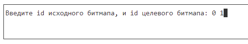
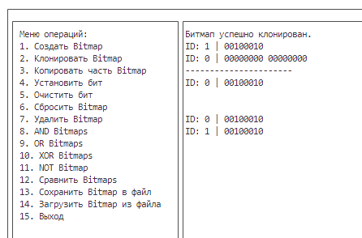

# Bitmap

 Проект ELTEX July 2024

Библиотека bitmap предоставляет функции для работы со структурой Bitmap.
Bitmap - это структура данных, которая позволяет компактно хранить биты.

####  Детали реализации:
1. Реализация в виде статической/динамической библиотеки
2. Наличие структуры данных bitmap
3. Наличие инициатора/деинициализатора
4. Наличие произвольного доступа и редактирования битов в структуре
5. Реализация выполнения побитовых операторов для двух bitmap: AND, OR, XOR
6. Реализация NOT
7. Реализация сравнения двух структур данных по значению: строго больше, больше, равно, меньше, строго меньше
8. Реализация функционала копирования
9. Реализация функционала клонирования
10. Реализация функционала сброса структуры данных
11. Проверка работоспособности автотестами
12. Реализация интерактивного режима работы с битмапами

#### Особенности реализации
1. Реализация склеивания двух битмапов
2. Cистема логирования через файл
3. Реализация побитовых операторов через плагины


## Сборка проекта Bitmap

Собрать проект можно при помощи утилиты *make*

### Сборка проекта при помощи make

Для сборки проекта необходимо выполнить команду:

```
$ make 
```
Для запуска демо с примерами использования функций выполните:

```
$ make run_demo
```
Для запуска проекта выполните:

```
$ make run 
```
Для запуска тестов выполните 

```
$ make test
$ make gcov_report
```
Для очистки проекта выполните:

```
$ make clean
```

### Взаимодействие с TUI:
Для выполнения операции необходимо написать ее номер из меню операций в поле ввода и нажать "enter".
После чего вам будет выведена дополнительная информация.
Например:

Результат выполнения операции будет выведен справа от меню:


## Описание функций библиотеки libbitmap:
**Пример использования функций находится в файле src/main_demo.c**

**Командные функции:**
```
int bitmap_create(Bitmap *bitmap, size_t bits);
```
Принимает указатель на создаваемую структуру bitmap и количество битов bits. Возвращает код успешного выполнения/ошибки. Создает новую структуру bitmap c количеством бит bits.
```
int bitmap_clone(const Bitmap *source, Bitmap *clone);
```
Принимает два указателя на структуру bitmap. Возвращает код успешного выполнения/ошибки. Копирует содержимое одной структуры в другую.
```
int bitmap_increase(Bitmap *bitmap, size_t length);
```
Функция принимает указатель на bitmap и его конечный размер. После чего увеличивает его размер с сохранением содержимого.
```
int bitmap_copy(const Bitmap *source, Bitmap *dest, size_t src_start,
                size_t length, size_t dest_start);
```
Функция принимает указатель на исходный битмап bitmap и на целевой, а так же индекс начала копируемого отрезка и его длину. После чего копирует содержимое отрезка в целевой bitmap.
```
int bitmap_show(const Bitmap *bitmap);
```
Функция принимает указатель на структуру bitmap. Выводит на экран содержимое bitmap справа налево.
```
int bitmap_set_bit(Bitmap *bitmap, size_t num, int val);
```
Принимает указатель на структуру bitmap, номер бита, который необходимо изменить (num), и значение val, на которое необходимо изменить (0/1). Возвращает код успешного выполнения/ошибки. Изменяет num-й бит в val 0/1.
```
int bitmap_clear_bit(Bitmap *bitmap, size_t num);
```
Принимает указатель на структуру bitmap, номер бита, который необходимо очистить. Возвращает код успешного выполнения/ошибки. Изменяет num-й бит в 0.
```
int bitmap_reset(Bitmap *bitmap);
```
Функция принимает указатель на структуру bitmap. Зануляет все биты массива bits.
```
int bitmap_delete(Bitmap *bitmap);
```
Функция принимает указатель на структуру bitmap. Освобождает память из-под битов и устанавливает размер 0.
```
int bitmap_file_save(const Bitmap *bitmap, const char *fname);
```
Функция принимает указатель на  bitmap и имя файла. Функция создает или
открывает существующий файл с указанным именем и записавает в него size и bits.
```
int bitmap_file_load(Bitmap *bitmap, const char *fname);
```
Функция принимает указатель на bitmap и имя файла. Функция открывает файл с указанным именем и загружает из него size и bits в переданную структуру. Передавать можно как указатель на пустой битмап(в этом случае создастся новый битмап с размером из файла), так и на уже созданный(в этом случае битмап удалится, и создастся новый по размеру из файла)
```
int bitmap_concat_in_place(Bitmap *bitmap1, const Bitmap *bitmap2);
```
Функция принимает 2 указателя на битмап. Склеивает два битмапа с сохранением в bitmap1.
```
size_t bits_to_byte(size_t bits);
```
Функция преобразует количество битов в количество байтов, округляя результат вверх до ближайшего целого.

**Операции сравнения:**
```
int bitmap_compare(Bitmap *bitmap1, const Bitmap *bitmap2);
```
Функция принимает указатели на два битмапа и сравнивает их. Функция возвращает 0 если битмапы равны, 1 если первый больше вторго, 2 если второй больше первого, -1 если произошла ошибка.
```
int bitmap_equal(Bitmap *bitmap1, const Bitmap *bitmap2);
```
Функция принимает указатели на два битмапа и проверяет на равенство. Функция возвращает 1 если битмапы равны, 0 если битмапы не равны, -1 если произошла ошибка.
```
int bitmap_strictly_greater(Bitmap *bitmap1, const Bitmap *bitmap2);
```
Функция принимает указатели на два битмапа и проверяет больше ли первый чем
второй. Функция возвращает 1 если первый больше второго, 0 если первый меньше или равен второму, -1 если произошла ошибка.
```
int bitmap_greater(Bitmap *bitmap1, const Bitmap *bitmap2);
```
Функция принимает указатели на два битмапа и проверяет больше ли первый чем
второй или они равны. Функция возвращает 1 если первый больше или равен второму,
0 если первый меньше второго, -1 если произошла ошибка.
```
int bitmap_strictly_less(Bitmap *bitmap1, const Bitmap *bitmap2);
```
Функция принимает указатели на два битмапа и проверяет меньше ли первый чем второй. Функция возвращает 1 если первый меньше второго, 0 если первый больше или равен второму, -1 если произошла ошибка.
```
int bitmap_less(Bitmap *bitmap1, const Bitmap *bitmap2);
```
Функция принимает указатели на два битмапа и проверяет меньше ли первый чем второй или они равны. Функция возвращает 1 если первый меньше или равен второму, 0 если первый больше второго, -1 если произошла ошибка.

**Побитовые операции:**
Реализованы через плагины.
```
typedef struct {
    int (*bitmap_and)(Bitmap *bitmap1, const Bitmap *bitmap2);
    int (*bitmap_or)(Bitmap *bitmap1, const Bitmap *bitmap2);
    int (*bitmap_xor)(Bitmap *bitmap1, const Bitmap *bitmap2);
    int (*bitmap_not)(Bitmap *bitmap);
} bitmap_plugin;
```
